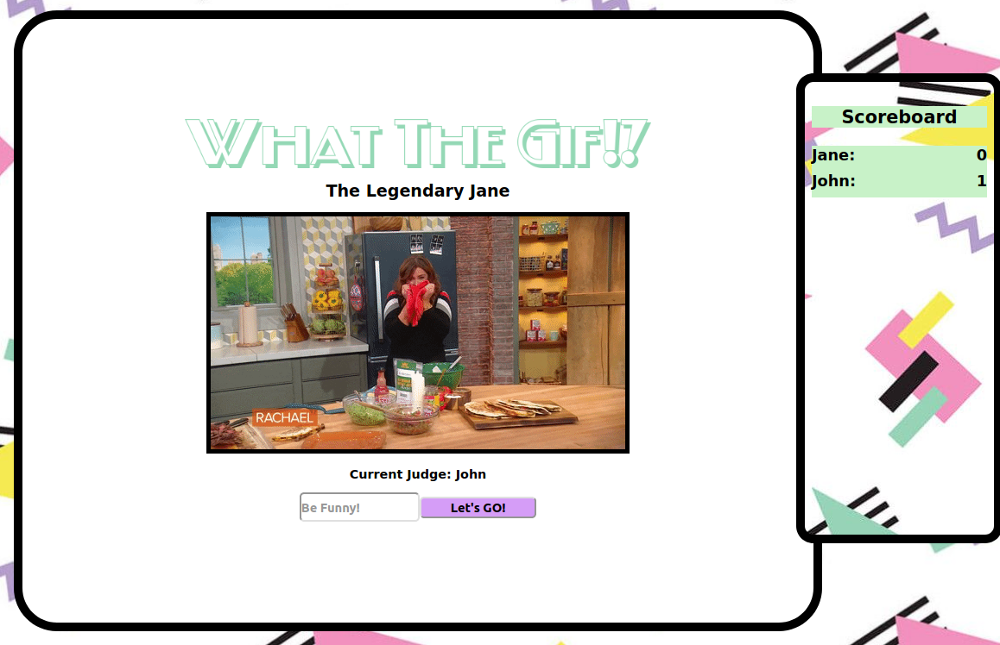

# WhatTheGif?!

A fun multiplayer online game to provide lots of laughs and bonding time. Write the funniest phrase for a random gif and make your friends laugh out loud.

# Tech Stack

- OAuth 2.0 with Google
- React Context API and Hooks (useState, useContext)
- WebSockets
- Webpack

# Instructions to play through VS Code Live Share:

1. Fork and Clone repo locally
2. Add .env file in root directory and include the following key-value pairs

   - API_KEY= "YOUR GIPHY API KEY"
   - REACT_APP_CLIENT_ID= "YOUR GOOGLE CLIENT ID for OAuth - not necessary if GoogleOAuth page is not rendered"
   - NODE_ENV=production

3. <code>npm install</code>
4. <code>npm run build</code>
5. Start a Live Share session on VS Code
6. Invite friends to your Live Share or send them the link
7. <code>npm start</code>
8. Make sure to be sharing your <code>localhost:3333</code> server through Live Share
9. Have all your friends go to http://localhost:3333 on their browsers
10. HAVE FUN! and come back to star our repo :star:

# Instructions to play over the same WiFi:

1. Add .env file in root directory and include the following key-value pairs

   - API_KEY= "YOUR GIPHY API KEY"
   - REACT_APP_CLIENT_ID= "YOUR GOOGLE CLIENT ID for OAuth - not necessary if GoogleOAuth page is not rendered"
   - NODE_ENV=production

2. Find your computer's IPAddress (IPv4) (Check out this link to go to your network - https://osxdaily.com/2011/10/05/find-router-ip-address-mac/)
3. In index.js update the socket io connection argument (line 9) to <code>'YourIPAddress':3333</code>
4. <code>npm install</code>
5. <code>npm run build</code>
6. <code>npm start</code>
7. On a different computer's browser, go to <code>'YourIPAddress':3333</code>

# Views

&nbsp; 

&nbsp; 

&nbsp; 

# Built By

- [Besik](https://github.com/brurua)
- [Cynthia](https://github.com/cfranq)
- [Jeho](https://github.com/howaboutjeho)
- [Roseanne](https://github.com/rosedamasco)
